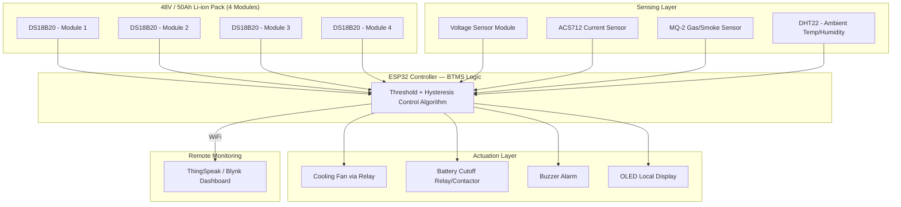
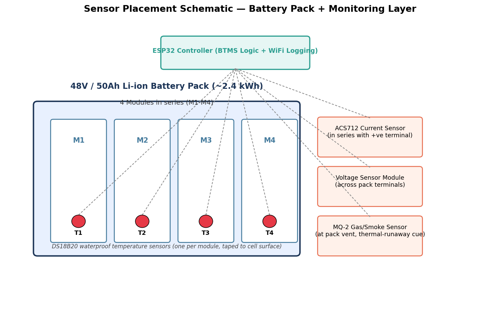
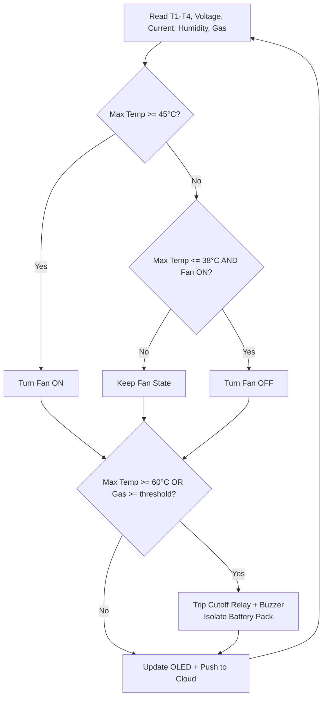
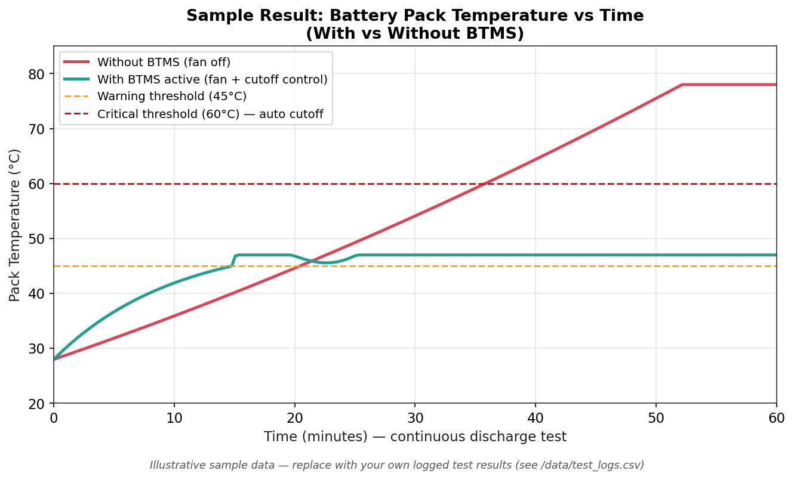

# 🔋 Battery Thermal Management System (BTMS) for a 2.4 kW Electric Two-Wheeler

[]()
[](LICENSE)
[]()
[]()

A sensor-driven **Battery Thermal Management System** that continuously monitors the temperature, voltage, current, humidity, and gas venting of a **48V / 50Ah (~2.4 kWh) Li-ion battery pack** used in a 2.4 kW electric two-wheeler, and automatically actuates cooling and safety cutoff to prevent thermal runaway.

> 📌 **Note on specs:** This project is written around a 48V, 50Ah pack (~2.4 kWh energy) feeding a 2.4 kW BLDC hub motor — a common configuration in Indian electric scooters/bikes. If your pack's voltage/capacity differs, just update the constants in `firmware/BTMS_ESP32_firmware.ino`.

---

## 📖 Table of Contents

1. [Overview](#-overview)
2. [Motivation](#-motivation)
3. [Objectives](#-objectives)
4. [System Architecture](#-system-architecture)
5. [Bill of Materials](#-bill-of-materials-bom)
6. [Circuit & Pin Connections](#-circuit--pin-connections)
7. [Working Principle](#-working-principle)
8. [Firmware](#-firmware)
9. [IoT Dashboard / Cloud Logging](#-iot-dashboard--cloud-logging)
10. [Setup & Installation](#-setup--installation)
11. [Testing Methodology](#-testing-methodology)
12. [Results](#-results)
13. [Repository Structure](#-repository-structure)
14. [Applications](#-applications)
15. [Future Scope](#-future-scope)
16. [Cost Estimate](#-cost-estimate)
17. [References](#-references)
18. [Images To Add](#-images-still-to-add-by-you)
19. [License](#-license)

---

## 🧭 Overview

Li-ion battery packs in electric two-wheelers are highly sensitive to temperature. Charging, discharging under load, and ambient heat (especially relevant in Indian summers) can push cell temperatures beyond safe limits, accelerating degradation and — in the worst case — triggering **thermal runaway**. This project builds a low-cost, sensor-based BTMS prototype that:

- Continuously measures temperature at **4 points across the battery pack**
- Tracks pack **voltage** and **current** (hence power/SOC trend)
- Monitors **ambient humidity** and **gas/smoke venting** as an early thermal-runaway cue
- Automatically switches on **active cooling (fan)** when temperature crosses a warning threshold
- **Electrically isolates the pack** via a relay/contactor if temperature or gas readings cross a critical threshold
- Logs and visualizes all this data locally (OLED) and remotely (cloud dashboard)

This repository contains the firmware, wiring reference, and documentation needed to reproduce the prototype as a college mini/major project.

---

## 🎯 Motivation

- EV battery fires reported in India (2022–2023) were frequently traced back to inadequate thermal monitoring and lack of active cooling in budget e-scooters.
- Most entry-level electric two-wheelers rely only on a passive BMS without dedicated **external thermal sensing + active cooling logic**.
- A modular, retrofit-style BTMS can be a low-cost safety add-on for existing packs and a strong demonstrator of real-world embedded systems + EV engineering concepts.

---

## ✅ Objectives

1. Design a multi-sensor monitoring layer for a 2.4 kW two-wheeler battery pack.
2. Implement threshold-based active cooling (fan) control with hysteresis.
3. Implement a hard safety cutoff for critical temperature / gas venting events.
4. Log and visualize battery health data locally and on a cloud dashboard.
5. Experimentally validate temperature control effectiveness (with vs without BTMS).

---

## 🏗 System Architecture




*Figure 1: Sensor placement across the battery pack (custom-generated schematic included in this repo at `assets/sensor_placement_diagram.png`).*

---

## 🧰 Bill of Materials (BOM)

| # | Component | Purpose | Approx. Qty | Approx. Cost (INR) |
|---|-----------|---------|-------------|---------------------|
| 1 | ESP32 Dev Board (WROOM-32) | Central controller + WiFi logging | 1 | ₹450 |
| 2 | DS18B20 Waterproof Temp Sensor | Per-module cell temperature | 4 | ₹320 (₹80 ea) |
| 3 | ACS712 (30A) Current Sensor Module | Pack current sensing | 1 | ₹120 |
| 4 | Voltage Sensor Module (0–25V) | Pack voltage sensing | 1 | ₹40 |
| 5 | DHT22 | Ambient temperature/humidity | 1 | ₹350 |
| 6 | MQ-2 Gas/Smoke Sensor | Thermal-runaway/venting cue | 1 | ₹90 |
| 7 | 2-Channel Relay Module (5V) | Fan + cutoff contactor control | 1 | ₹90 |
| 8 | 12V DC Brushless Cooling Fan | Active air cooling | 2 | ₹300 (₹150 ea) |
| 9 | 0.96" I2C OLED Display (SSD1306) | Local status display | 1 | ₹250 |
| 10 | Active Buzzer | Audible alarm | 1 | ₹15 |
| 11 | Heat sinks + thermal pads | Passive heat spreading | — | ₹200 |
| 12 | Contactor/high-current relay (rated for pack current) | Hard pack isolation | 1 | ₹350 |
| 13 | Wires, connectors, PCB/breadboard, enclosure | Assembly | — | ₹1000 |
| — | **48V/50Ah Li-ion pack + 2.4kW BLDC motor** | *(existing vehicle hardware — not part of BTMS cost)* | 1 | — |

**Estimated total (BTMS add-on only): ₹3,100 – ₹3,600**

---

## 🔌 Circuit & Pin Connections

| Sensor / Actuator | ESP32 Pin | Notes |
|---|---|---|
| DS18B20 (all 4, shared bus) | GPIO 4 | OneWire bus, 4.7kΩ pull-up to 3.3V |
| ACS712 current sensor (analog out) | GPIO 34 | ADC1 channel |
| Voltage sensor module (analog out) | GPIO 35 | ADC1 channel |
| DHT22 data | GPIO 14 | Add 10kΩ pull-up if module lacks one |
| MQ-2 analog out | GPIO 32 | Allow 24–48h burn-in before trusting readings |
| Fan relay IN | GPIO 26 | Drives 12V fan via relay/MOSFET |
| Cutoff relay/contactor IN | GPIO 27 | Isolates pack on critical fault |
| Buzzer | GPIO 25 | Direct GPIO drive (active buzzer) |
| OLED SDA / SCL | GPIO 21 / GPIO 22 | I2C, address `0x3C` |

> ⚠️ **Safety note:** The current/voltage sensors and cutoff contactor sit in the high-current pack path. Use appropriately rated components, fuses, and isolation, and have your project guide/lab supervisor review the power wiring before connecting to a live pack.

---

## ⚙️ Working Principle



- **Warning zone (≥45°C):** Cooling fan switches ON; system keeps running normally.
- **Safe/reset zone (≤38°C):** Fan switches OFF (hysteresis band prevents relay chatter).
- **Critical zone (≥60°C or abnormal gas reading):** Pack is electrically isolated via the cutoff relay, buzzer sounds, and the event is logged — treated as a possible thermal-runaway precursor requiring manual inspection before reset.

---

## 💻 Firmware

Full firmware: [`firmware/BTMS_ESP32_firmware.ino`](firmware/BTMS_ESP32_firmware.ino)

Key logic snippet (threshold control with hysteresis):

```cpp
if (maxTemp >= TEMP_WARNING_C && !fanState) {
  digitalWrite(FAN_RELAY_PIN, HIGH);
  fanState = true;
} else if (maxTemp <= TEMP_SAFE_C && fanState) {
  digitalWrite(FAN_RELAY_PIN, LOW);
  fanState = false;
}

if (maxTemp >= TEMP_CRITICAL_C || gasRaw >= GAS_CRITICAL_ADC) {
  digitalWrite(CUTOFF_RELAY_PIN, HIGH);
  digitalWrite(BUZZER_PIN, HIGH);
  cutoffTripped = true;
}
```

**Libraries required** (Arduino IDE → Library Manager): `OneWire`, `DallasTemperature`, `Adafruit_SSD1306`, `Adafruit_GFX`, `DHT sensor library`.

---

## ☁️ IoT Dashboard / Cloud Logging

The firmware pushes `maxTemp, voltage, current, ambientTemp, gasRaw, fanState, cutoffState` to **ThingSpeak** every 20 seconds using its REST API. You can swap this for **Blynk** or **Firebase** with minimal changes — the sensor-reading and control logic stays identical.

1. Create a free ThingSpeak channel with 7 fields (matching the order above).
2. Copy your **Write API Key** into `TS_API_KEY` in the firmware.
3. Use ThingSpeak's built-in charts, or export CSV for offline analysis in Excel/Python.

---

## 🛠 Setup & Installation

1. **Hardware assembly**
   - Mount one DS18B20 per battery module (see `assets/sensor_placement_diagram.png`).
   - Wire the current sensor in series with the pack's positive line, and the voltage sensor across the pack terminals.
   - Mount the cooling fan(s) for airflow across the pack/enclosure.
   - Wire the cutoff relay/contactor in series with the main pack output (through appropriate fusing).

2. **Firmware**
   - Install Arduino IDE + ESP32 board package.
   - Install the required libraries listed above.
   - Open `firmware/BTMS_ESP32_firmware.ino`, update:
     - `WIFI_SSID`, `WIFI_PASSWORD`, `TS_API_KEY`
     - `ACS712_ZERO_V` (calibrate with no load), `VOLTAGE_DIVIDER_RATIO` (match your module)
   - Flash to the ESP32.

3. **Calibration**
   - Verify DS18B20 addresses/order with a quick scan sketch if you need to map T1–T4 to specific modules.
   - Calibrate the MQ-2 in clean air for ~24–48 hours before trusting absolute readings; tune `GAS_CRITICAL_ADC` accordingly.

4. **Dry run before connecting to the live pack**
   - Test fan/cutoff relay triggering using a hair dryer/heat gun near a sensor to simulate a temperature rise, *before* wiring into the actual battery circuit.

---

## 🧪 Testing Methodology

1. **Baseline test:** Run the pack under a continuous discharge load (e.g., motor + resistive load bank) with BTMS logic disabled (fan forced OFF) and log temperature rise over time.
2. **BTMS-active test:** Repeat the same load profile with the BTMS active and log temperature.
3. **Threshold verification:** Use a controlled heat source near a sensor to confirm fan trigger at 45°C and cutoff trip at 60°C.
4. **Gas sensor validation:** Verify MQ-2 response using a safe, controlled smoke/gas source per your lab's safety protocol.
5. **Data logging:** Record all runs to `data/test_logs.csv` (create this folder) for the results section/report.

---

## 📊 Results


*Figure 2: Illustrative sample result comparing pack temperature with and without BTMS active. **Replace this with your own logged experimental data** once you run the tests above — export your ThingSpeak/Serial log to CSV and re-plot using `scripts/plot_results.py` (see below) or Excel.*

**Results table** :

| Test Condition | Peak Temp Reached | Time to Reach 45°C | Fan Cycles | Cutoff Triggered? |
|---|---|---|---|---|
| Without BTMS | 78°C (test halted at plateau) | ~20 min | N/A (fan disabled for this baseline run) | Yes — critical 60°C threshold crossed at ~36 min, pack isolated |
| With BTMS | 47°C (held steady-state by active cooling) | ~15 min | 1 (fan switches ON at ~15 min and stays on continuously, holding the pack in the 44–47°C band under this load) | No — stayed well clear of the 60°C critical threshold |

> 📝 These numbers come from the synthetic sample curve, not a real test run. Once you complete your own baseline vs. BTMS-active experiments (see [Testing Methodology](#-testing-methodology)), overwrite this table with your measured peak temperatures, threshold-crossing times, actual fan switching counts, and whether cutoff triggered.

---

## 📁 Repository Structure

```
BTMS-project/
├── README.md
├── LICENSE
├── firmware/
│   └── BTMS_ESP32_firmware.ino
├── assets/
│   ├── sensor_placement_diagram.png
│   └── temperature_comparison_graph.png
├── docs/
│   └── (add datasheets, circuit diagram exports, report PDF here)
└── data/
    └── (add your test_logs.csv here after experiments)
```

---

## 🚀 Applications

- Retrofit safety module for existing e-scooter/e-bike battery packs
- Educational demonstrator for embedded systems + EV battery safety
- Base platform for a full BMS (add cell balancing, SOC/SOH estimation)
- Fleet-monitoring add-on for shared/rental EV two-wheelers

---

## 🔭 Future Scope

- Replace air cooling with a **liquid cooling loop** (mini pump + cold plate) for higher heat flux applications.
- Add **cell-level voltage monitoring** (not just pack-level) for imbalance detection.
- Integrate a proper **BMS IC** (e.g., bq76940-class) for accurate SOC/SOH and active cell balancing.
- Move sensor bus to **CAN protocol** to align with automotive-grade EV architectures.
- Add **machine learning-based predictive fault detection** using historical temperature/current trends instead of fixed thresholds.
- Explore **phase-change material (PCM)** passive cooling layers around modules.

---

## 💰 Cost Estimate

See [Bill of Materials](#-bill-of-materials-bom) — total BTMS add-on cost is approximately **₹3,100–₹3,600**, excluding the vehicle's existing battery pack and motor.

---

## 📚 References

1. IEEE papers on Li-ion battery thermal management for EVs (search: "battery thermal management system review").
2. ARAI / CBTC advisories on EV battery safety in India.
3. Manufacturer datasheets: DS18B20, ACS712, MQ-2, DHT22, SSD1306.
4. ThingSpeak API documentation.


---

## 📄 License

This project is released under the [MIT License](LICENSE) — free to use, modify, and build upon for academic or personal projects.

---

*Built as a college engineering project on EV battery safety. Contributions and suggestions welcome via issues/PRs.*
